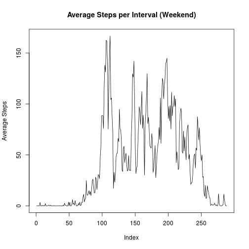

<center><h1> Peer Assessment 1 </h1> </center>

<br> </br>

### Loading and Processing Data 
<br> </br>
With the file `activity.csv` in our working directory, we load the data with 

```r
activityData <- read.csv("activity.csv")
```
<br> </br>

### Total Steps Each Day
<br> </br>

To compute the number of total steps taken each day, we run

```r
totalDayData <- tapply(activityData$steps, activityData$date, sum)
head(totalDayData)
```

```
## 2012-10-01 2012-10-02 2012-10-03 2012-10-04 2012-10-05 2012-10-06 
##         NA        126      11352      12116      13294      15420
```

We can graphically represent this data with a histogram. We run


```r
hist(totalDayData, breaks = 20)
```

 

We also may wish to consider the mean and median of the data, as well as other important measures (such as the number of values that are NA). 

```r
summary(totalDayData)
```

```
##    Min. 1st Qu.  Median    Mean 3rd Qu.    Max.    NA's 
##      41    8841   10760   10770   13290   21190       8
```
<br> </br>

### Average Daily Activity Pattern 
<br> </br>

To consider average daily activity, we would like to take a mean over each interval. 


```r
averageInterval <- tapply(activityData$steps, activityData$interval, mean, na.rm = TRUE)

plot(averageInterval, type = "l", main = "Average Steps per 5-minute Interval")
```

 

To learn which interval contains the maximum number of steps (on average), we run 


```r
which.max(averageInterval)
```

```
## 835 
## 104
```

This tells us that the 104th interval (number 835) is on average the one with the most activity. 

<br> </br>

### Inputting Missing Values

<br> </br>

An easy way to compute the number of missing values is through

```r
sum(is.na(activityData))
```

```
## [1] 2304
```

There are 2304 missing values. One way we might fill these in is by inputting the average number of steps for that interval across days where there was data. 


```r
activityData_filled = activityData
activityData_filled[, 1][is.na(activityData[,1])] = averageInterval[as.character(activityData[,3][is.na(activityData[,1])])]
head(activityData_filled)
```

```
##       steps       date interval
## 1 1.7169811 2012-10-01        0
## 2 0.3396226 2012-10-01        5
## 3 0.1320755 2012-10-01       10
## 4 0.1509434 2012-10-01       15
## 5 0.0754717 2012-10-01       20
## 6 2.0943396 2012-10-01       25
```

With the missing data filled in, we analyze steps taken each day again. 


```r
totalDayData_filled <- tapply(activityData_filled$steps, activityData_filled$date, sum)
hist(totalDayData_filled, 20)
```

 

We also consider the mean and median of the data:


```r
summary(totalDayData_filled)
```

```
##    Min. 1st Qu.  Median    Mean 3rd Qu.    Max. 
##      41    9819   10770   10770   12810   21190
```

This is not very different from when we previously computed these values, except that the 8 NA values have dissappeared. Looking at the histogram, we can see the central spike has grown in the second dataset. The reason behind this is apparent after running 


```r
table(activityData$date[is.na(activityData$steps)])
```

```
## 
## 2012-10-01 2012-10-02 2012-10-03 2012-10-04 2012-10-05 2012-10-06 
##        288          0          0          0          0          0 
## 2012-10-07 2012-10-08 2012-10-09 2012-10-10 2012-10-11 2012-10-12 
##          0        288          0          0          0          0 
## 2012-10-13 2012-10-14 2012-10-15 2012-10-16 2012-10-17 2012-10-18 
##          0          0          0          0          0          0 
## 2012-10-19 2012-10-20 2012-10-21 2012-10-22 2012-10-23 2012-10-24 
##          0          0          0          0          0          0 
## 2012-10-25 2012-10-26 2012-10-27 2012-10-28 2012-10-29 2012-10-30 
##          0          0          0          0          0          0 
## 2012-10-31 2012-11-01 2012-11-02 2012-11-03 2012-11-04 2012-11-05 
##          0        288          0          0        288          0 
## 2012-11-06 2012-11-07 2012-11-08 2012-11-09 2012-11-10 2012-11-11 
##          0          0          0        288        288          0 
## 2012-11-12 2012-11-13 2012-11-14 2012-11-15 2012-11-16 2012-11-17 
##          0          0        288          0          0          0 
## 2012-11-18 2012-11-19 2012-11-20 2012-11-21 2012-11-22 2012-11-23 
##          0          0          0          0          0          0 
## 2012-11-24 2012-11-25 2012-11-26 2012-11-27 2012-11-28 2012-11-29 
##          0          0          0          0          0          0 
## 2012-11-30 
##        288
```

The output above makes it clear that days that reported NA were missing all of their values. Therefore the total steps for these days would just be the overall average after inputting missing data. 


```r
day <- weekdays(strptime(activityData_filled$date, format="%Y-%m-%d"))
activityData_filled$isWeekday <- !(day == "Saturday" | day == "Sunday")
```

We now plot the average number of steps taken over each interval across either weekdays or weekend days. 


```r
weekdayData <- subset(activityData_filled, activityData_filled$isWeekday)

weekendData <- subset(activityData_filled, !activityData_filled$isWeekday)

plot(tapply(weekdayData$steps, weekdayData$interval, mean),type = "l", ylab = "Average Steps", main = "Average Steps per Interval (Weekday)")
```

 

```r
plot(tapply(weekendData$steps, weekendData$interval, mean),type = "l", ylab = "Average Steps",main = "Average Steps per Interval (Weekend)")
```

 

